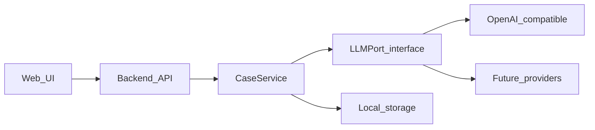
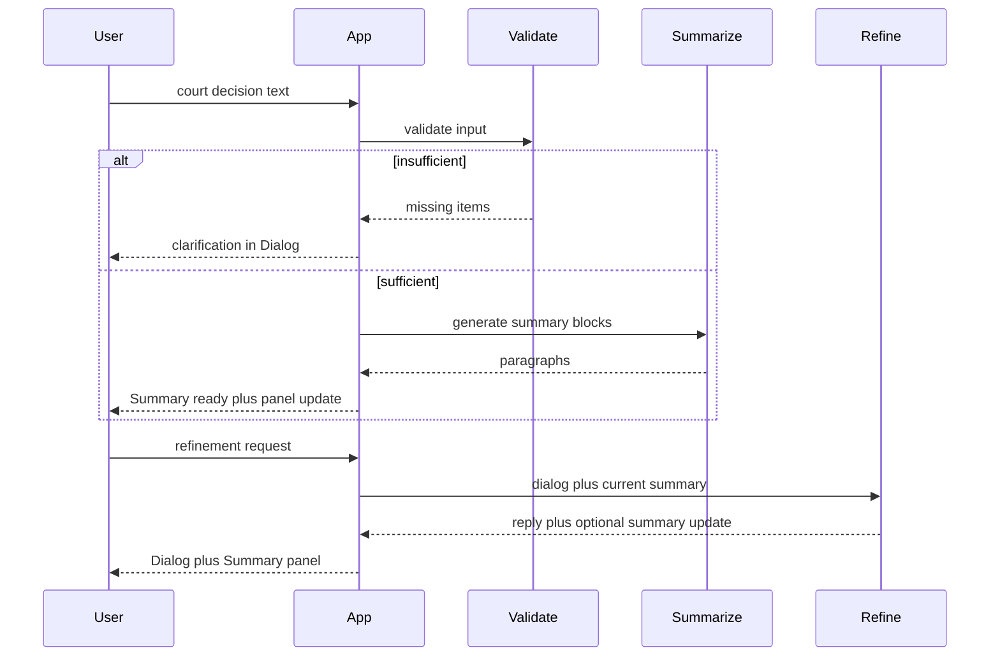

# Technical Specification: Court Decision Summarizer (MVP)

**Document version:** 1.0  
**Status:** Approved for development  
**Last updated:** 2026-05-15

---

## Table of contents

1. [General information](#1-general-information)
2. [Deployment and startup](#2-deployment-and-startup)
3. [Local data storage](#3-local-data-storage)
4. [Functional requirements (UI)](#4-functional-requirements-ui)
5. [Input sufficiency criteria](#5-input-sufficiency-criteria)
6. [LLM processing pipeline](#6-llm-processing-pipeline)
7. [Internal API contract](#7-internal-api-contract)
8. [Non-functional requirements](#8-non-functional-requirements)
9. [MVP acceptance criteria](#9-mvp-acceptance-criteria)
10. [Out of scope](#10-out-of-scope)
11. [Recommended technology stack](#11-recommended-technology-stack)
12. [Repository artifacts](#12-repository-artifacts)

---

## 1. General information

### 1.1. Product overview

| Field | Value |
|-------|-------|
| **Product name** | Court Decision Summarizer |
| **Product type** | Local web application (MVP) |
| **Target user** | Lawyer or legal professional |
| **MVP goal** | Paste or type a court decision text, receive a structured summary built from configurable blocks, refine it via dialog, browse case history, and review usage statistics |
| **UI language** | English (all labels, system messages, validation errors) |
| **Content language** | Input and generated summaries are primarily Russian (Russian Federation court decisions); LLM prompts are configurable; default generation language is Russian |

### 1.2. Business objective

Deliver a minimum viable product (MVP) that runs locally on the user's computer, starts and stops with a single command or script, stores settings, case history, and logs on disk, and abstracts LLM connectivity so the model and connection method can be changed during operation without rewriting business logic.

### 1.3. Terms and definitions

| Term | Definition |
|------|------------|
| **Application (App)** | The locally running web application described in this document |
| **User** | End user operating the App on their own computer |
| **Case** | A unit of work: court decision source text, dialog history, summary, and metadata |
| **Dialog** | Chat-style interface for messages exchanged between the User and the App for one Case |
| **Summary** | Structured output produced by processing a Case |
| **Summary paragraph** | One paragraph in the Summary panel, corresponding to one active **Summary block** from Settings |
| **Summary block** | Configuration entity defining a section of the Summary (name, LLM instruction, active flag, sort order). Internal entity name: `response_block` |
| **Template** | Saved text snippet that can be appended to a Summary paragraph |
| **LLM provider** | External or local language model accessed through an abstract adapter |

### 1.4. MVP constraints

- Single User, single local instance; authentication is not required.
- All data resides on the User's disk; cloud sync is out of scope.
- **Supported OS (acceptance):** Windows 10/11, Linux (current LTS distributions as of 2026).
- **Optional (not in acceptance criteria):** macOS.
- **Browsers:** Latest stable Chrome, Firefox, Edge.

### 1.5. UI navigation (English labels)

The main navigation exposes four sections:

| Section ID | UI label |
|------------|----------|
| `work` | Work on case |
| `history` | Case history |
| `statistics` | Statistics |
| `settings` | Settings |

Settings contains two tabs:

| Tab ID | UI label |
|--------|----------|
| `blocks` | Summary blocks |
| `templates` | Templates |

---

## 2. Deployment and startup

### 2.1. One-command lifecycle

The App MUST be startable and stoppable with one command or one file:

| Platform | Script | Behavior |
|----------|--------|----------|
| Linux | `run.sh` | `start` launches the App; `stop` shuts it down; optional `toggle` |
| Windows | `run.bat` | Equivalent to `run.sh` |

The script MUST:

1. Verify Python **3.11+** is available.
2. Create or reuse a virtual environment.
3. Install dependencies from `requirements.txt` if needed.
4. Start the backend server.
5. Optionally open the default browser at the App URL.

### 2.2. Network binding

- Default host: `127.0.0.1` (localhost only).
- Default port: `8765` (configurable via environment variable, e.g. `APP_PORT`).
- The App MUST NOT listen on `0.0.0.0` by default.

### 2.3. LLM configuration (runtime change without rebuild)

Connection parameters and secrets are stored in `.env` (see `.env.example`):

| Variable (example) | Purpose |
|--------------------|---------|
| `LLM_PROVIDER` | Provider identifier (e.g. `openai_compatible`) |
| `LLM_BASE_URL` | API base URL |
| `LLM_API_KEY` | API key (if required) |
| `LLM_MODEL` | Model name |
| `LLM_TIMEOUT_SEC` | Request timeout (default: 120) |

#### 2.3.1. LLM adapter layer

Business logic MUST depend only on an abstract **LLM port**:

```
complete(messages: list[Message], options: CompletionOptions) -> CompletionResult

CompletionResult:
  text: str
  usage: { prompt_tokens, completion_tokens, total_tokens }
```

MVP MUST ship at least one implementation: **OpenAI-compatible HTTP API** (OpenAI, Azure OpenAI, Ollama, vLLM, etc.).

Adding a new provider MUST require only:

1. A new adapter class implementing the LLM port.
2. A configuration entry mapping `LLM_PROVIDER` to that class.

Case processing, validation, summarization, and refinement MUST NOT import provider-specific SDKs directly.



Token usage returned by the adapter MUST be persisted for Statistics (Section 4.4).

---

## 3. Local data storage

### 3.1. Storage layout

| Category | Contents | Path (example) |
|----------|----------|----------------|
| Settings | Summary blocks, Templates, validation thresholds | `data/settings.json` |
| Cases | Messages, summary text, flags, timestamps | SQLite + optional `data/cases/{id}/` attachments |
| Logs | Application and per-request LLM logs | `data/logs/` |
| Statistics | Token usage, timing events | SQLite tables |

**Recommended MVP approach:** SQLite for cases, messages, events, and token aggregates; JSON file for settings; rotating log files on disk.

Directories `data/` and `.env` MUST be listed in `.gitignore`.

### 3.2. Case history retention

- Every created Case appears in **Case history**.
- Retention period: **3 calendar days** from **`updated_at`** (last activity: message sent, summary edited, template applied, etc.).
- A background job MUST run on App startup and periodically (e.g. every 6 hours) to delete Cases where `updated_at` is older than the retention window.
- The User MAY open any non-expired Case from history and continue the Dialog; the App MUST restore messages, Summary text, manual-edit flags, and context for subsequent LLM calls.

### 3.3. Data entities (logical model)

#### Case

| Field | Type | Description |
|-------|------|-------------|
| `id` | UUID | Primary key |
| `created_at` | datetime | Creation time |
| `updated_at` | datetime | Last activity (drives TTL) |
| `source_preview` | string | First ~80 characters of initial court decision |
| `summary_text` | text | Full Summary (`\n\n` between paragraphs) |
| `summary_user_edited` | boolean | True if User edited Summary manually or via template |
| `status` | enum | `active`, `summary_ready`, etc. |

#### Dialog message

| Field | Type | Description |
|-------|------|-------------|
| `id` | UUID | Primary key |
| `case_id` | UUID | Foreign key |
| `role` | enum | `user`, `assistant` |
| `content` | text | Message body |
| `created_at` | datetime | Timestamp |

#### Summary block (settings)

| Field | Type | Description |
|-------|------|-------------|
| `id` | UUID | Primary key |
| `name` | string | Required; internal label (not shown in Summary panel) |
| `instruction` | text | LLM instruction, max 100,000 characters |
| `active` | boolean | If false, excluded from generation |
| `sort_order` | integer | Display and generation order |

#### Template (settings)

| Field | Type | Description |
|-------|------|-------------|
| `id` | UUID | Primary key |
| `name` | string | Required |
| `text` | text | Max 100,000 characters |

---

## 4. Functional requirements (UI)

### 4.1. Work on case

#### 4.1.1. Layout

| Area | UI elements | Behavior |
|------|-------------|----------|
| Main (left or center) | Dialog thread, text input, **Send** | Standard chat UX; scrollable history |
| Side panel (right) | **Summary** | Single multiline editable field; paragraphs separated by blank line (`\n\n`); no visible block titles |
| Per paragraph | **Apply template** | Opens template picker modal |
| Top bar | **New case** | Starts a new Case; confirm if current Case has unsaved dialog draft (optional) |

#### 4.1.2. New Case flow

1. User clicks **New case** or opens Work on case with no active Case.
2. User pastes or types the court decision text and clicks **Send**.
3. App runs **input validation** (Section 5).
   - If insufficient: App posts a clarification message in the Dialog listing what is missing; Summary is **not** generated.
   - If sufficient: App generates Summary and posts a short Dialog message (e.g. **"Summary is ready."**) without duplicating the full Summary in the chat unless configured otherwise.
4. Summary panel displays **N** paragraphs—one per active Summary block, in `sort_order`, with no headings.

#### 4.1.3. Dialog continuation

The User MAY:

- Request corrections to the Summary via natural language in the Dialog.
- Ask questions about the decision or the Summary.
- Request further processing of the Case.

The App MUST:

- Reply in the Dialog.
- Update the Summary when required, keeping paragraph count aligned with active Summary blocks.
- Treat the current Summary text (including manual edits) as authoritative User state on subsequent LLM updates (see `prompts/refine.md`).

When the User edits Summary text directly in the panel, the App MUST persist changes immediately (debounced save acceptable, max 2 s delay) and set `summary_user_edited = true`.

#### 4.1.4. Apply template

1. User clicks **Apply template** on a paragraph.
2. Modal opens: searchable list of Templates (filter matches **name** or **text**, case-insensitive).
3. User selects a Template.
4. App **appends** Template text to the paragraph:
   - If paragraph is non-empty: insert a single space, then Template text.
   - If paragraph is empty: insert Template text only.
5. App sets `summary_user_edited = true` and persists.

#### 4.1.5. Key UI strings (English)

| Key | Text |
|-----|------|
| `send` | Send |
| `new_case` | New case |
| `summary_ready` | Summary is ready. |
| `apply_template` | Apply template |
| `search_templates` | Search templates… |
| `confirm_new_case` | Start a new case? The current case will be saved to history. |
| `confirm_new_case_unsaved` | You have unsent text. Start a new case anyway? |

### 4.2. Case history

| Column / field | Description |
|----------------|-------------|
| Preview | First ~80 characters of court decision |
| Created | `created_at` |
| Updated | `updated_at` |
| Status | `active` or `expiring` (within 24 h of TTL) |
| Time remaining | Optional: hours until auto-deletion |

**Actions:**

| Action | UI label | Behavior |
|--------|----------|----------|
| Open | Open | Load Case into Work on case |
| Delete | Delete | Immediate removal (optional, recommended) |

- Default sort: `updated_at` descending.
- Expired Cases MUST NOT appear in the list.

### 4.3. Settings

#### 4.3.1. Summary blocks

The User MUST be able to **create**, **edit**, **delete**, and **reorder** Summary blocks (drag-and-drop or **Move up** / **Move down**).

| Property | UI label | Type | Rules |
|----------|----------|------|-------|
| Name | Name | string | Required, max 200 characters |
| Instruction | Instruction | text | Required for active blocks, max 100,000 characters |
| Active | Active | boolean | Inactive blocks are skipped during generation |

Changes MUST take effect on the **next** LLM operation without restarting the App.

**Default seed data (first run):**

| Order | Name (EN) | Instruction (RU, example seed) |
|-------|-----------|--------------------------------|
| 1 | Claim | Кратко изложи требования истца (заявителя): что именно просит суд, в каком объёме. Без процессуальных формулировок, 2–4 предложения. |
| 2 | Circumstances | Изложи ключевые фактические обстоятельства дела, установленные судом. Только существенные факты, 3–6 предложений. |
| 3 | Decision | Изложи резолютивную часть: что решил суд, удовлетворены ли требования полностью, частично или отказано. 2–4 предложения. |

#### 4.3.2. Templates

The User MUST be able to **create**, **edit**, and **delete** Templates.

| Property | UI label | Type | Rules |
|----------|----------|------|-------|
| Name | Name | string | Required, max 200 characters |
| Text | Text | text | Max 100,000 characters |

Template search in the Apply template modal filters by Name and Text.

### 4.4. Statistics

#### 4.4.1. Filters

| Filter | Options |
|--------|---------|
| Period | Today, Last 7 days, Last 30 days, All time, Custom range (from–to) |
| Scope | All cases, or select one Case |

#### 4.4.2. Token metrics

For the selected scope and period, display:

| Metric | Description |
|--------|-------------|
| Prompt tokens | Sum of prompt tokens |
| Completion tokens | Sum of completion tokens |
| Total tokens | Sum of total tokens |
| LLM calls | Count of LLM requests |

Per-Case breakdown: table with one row per Case.  
Aggregate row for "All cases" when scope is all.

MVP: table is sufficient; charts are optional.

#### 4.4.3. Timing metrics

The App MUST log events with `timestamp`, `case_id`, and `event_type`:

| `event_type` | Description |
|--------------|-------------|
| `case_started` | User started a new Case |
| `user_message_sent` | User sent a Dialog message |
| `app_message_sent` | App sent a Dialog message |
| `summary_generated` | Initial Summary generated |
| `summary_updated` | Summary updated by LLM |
| `clarification_requested` | App requested clarification (validation failed) |
| `clarification_provided` | User replied after clarification request |

**Reports:**

- **Per Case:** event timeline, deltas between consecutive events, wall-clock time from first `user_message_sent` to first `summary_generated`.
- **System-wide:** case count, average and median time to summary; p95 optional.

---

## 5. Input sufficiency criteria

Before the first Summary generation for a Case, the App MUST run **input validation** using the prompt template `prompts/validate_input.md`.

Input is **sufficient** only if **all** of the following hold:

### 5.1. Length

- Text length ≥ **500 characters** (configurable in settings as `min_input_chars`, default 500).

### 5.2. Document type

- LLM classifier returns `is_court_decision: true`.
- If `is_court_decision: false`, validation fails with a user-facing explanation (e.g. **"The text does not appear to be a court decision."**).

### 5.3. Structural completeness

The validator returns JSON. All of the following structural checks MUST pass (or be marked `present: true` by the model with acceptable confidence):

| Check ID | Requirement |
|----------|-------------|
| `court_identified` | Court name or jurisdiction is identifiable |
| `subject_matter` | Subject of dispute or claims is described, even in general terms |
| `facts_or_positions` | Factual background, parties' positions, or equivalent substantive content |
| `outcome_or_dispositive` | Dispositive part or clear outcome (granted, denied, partially granted, etc.) |

### 5.4. Insufficient input behavior

- App MUST NOT call the summarize prompt.
- App posts a Dialog message listing **1–5** specific missing items in English.
- App logs `clarification_requested`.
- User reply triggers re-validation; append new text to Case source context before re-checking.

### 5.5. Partial uncertainty

If the model reports low confidence on one structural check (e.g. missing dispositive section but strong motivational part), the App MAY request **one** clarification round, then re-validate. After the User's follow-up, either proceed to summarize or fail with an explicit message.

---

## 6. LLM processing pipeline



### 6.1. Prompt templates

| Stage | File | When used |
|-------|------|-----------|
| Validation | `prompts/validate_input.md` | First message on a new Case (and after clarification before first summary) |
| Summarize | `prompts/summarize.md` | First successful validation |
| Refine | `prompts/refine.md` | Subsequent User messages on the same Case |

### 6.2. Summarize output format

- Output MUST contain exactly **N** paragraphs, where **N** = count of active Summary blocks in `sort_order`.
- Paragraphs separated by exactly `\n\n`.
- No headings, labels, or block names in the output text.
- Each paragraph MUST follow the corresponding block's **Instruction**.

### 6.3. Refine behavior

- Input: full Dialog history (or sliding window with system summary if token limits apply), current `summary_text`, `summary_user_edited` flag, active Summary blocks.
- Output: JSON with `dialog_reply` (string) and optional `summary_text` (full updated Summary, same paragraph rules).
- If User manually edited Summary, refinement MUST preserve User intent and merge changes rather than blind overwrite.

### 6.4. Logging

Every LLM call MUST log: `request_id`, `case_id`, stage (`validate` | `summarize` | `refine`), model name, latency ms, token usage, success/failure.

---

## 7. Internal API contract

Base path: `/api`. All responses JSON unless noted. Errors: `{ "error": { "code": string, "message": string } }`.

### 7.1. Cases

| Method | Path | Description |
|--------|------|-------------|
| `POST` | `/cases` | Create new Case; returns `{ id }` |
| `GET` | `/cases` | List Cases for history (non-expired) |
| `GET` | `/cases/{id}` | Case detail, messages, summary |
| `DELETE` | `/cases/{id}` | Delete Case immediately |
| `POST` | `/cases/{id}/messages` | Body: `{ "content": string }`; triggers validate/summarize/refine pipeline |
| `PATCH` | `/cases/{id}/summary` | Body: `{ "summary_text": string }`; manual save |
| `POST` | `/cases/{id}/summary/apply-template` | Body: `{ "block_index": int, "template_id": uuid }` |

### 7.2. Settings

| Method | Path | Description |
|--------|------|-------------|
| `GET` | `/settings/blocks` | List Summary blocks |
| `POST` | `/settings/blocks` | Create block |
| `PUT` | `/settings/blocks/{id}` | Update block |
| `DELETE` | `/settings/blocks/{id}` | Delete block |
| `PUT` | `/settings/blocks/reorder` | Body: `{ "ordered_ids": [uuid] }` |
| `GET` | `/settings/templates` | List Templates |
| `POST` | `/settings/templates` | Create Template |
| `PUT` | `/settings/templates/{id}` | Update Template |
| `DELETE` | `/settings/templates/{id}` | Delete Template |

### 7.3. Statistics

| Method | Path | Query params |
|--------|------|--------------|
| `GET` | `/statistics/tokens` | `from`, `to`, `case_id` (optional) |
| `GET` | `/statistics/timing` | `from`, `to`, `case_id` (optional) |

### 7.4. Real-time updates (optional MVP enhancement)

- MVP MAY use synchronous REST (User waits for LLM completion).
- Optional: Server-Sent Events on `POST .../messages` for streaming Dialog replies.

---

## 8. Non-functional requirements

| ID | Requirement |
|----|-------------|
| NF-01 | UI actions that do not call the LLM respond within **300 ms** (p95) on a typical developer machine |
| NF-02 | LLM request timeout configurable; default **120 seconds** |
| NF-03 | LLM or network errors show a Dialog message and are written to logs; the App process MUST NOT crash |
| NF-04 | Log rotation: default **50 MB** per file, **5** retained files (configurable) |
| NF-05 | No data sent to third parties except the configured LLM endpoint |
| NF-06 | Secrets only in `.env`; never committed to version control |
| NF-07 | SQLite WAL mode recommended for concurrent read during UI polling |

---

## 9. MVP acceptance criteria

| # | Criterion |
|---|-----------|
| AC-01 | `run.sh start` / `run.bat start` launches the App on Linux and Windows; `stop` terminates it |
| AC-02 | All four main sections are reachable and match Section 4 |
| AC-03 | Insufficient primary input produces clarification in Dialog only; no Summary |
| AC-04 | Valid court decision produces Summary with N paragraphs matching active blocks |
| AC-05 | Dialog refinement updates Summary and respects manual edits |
| AC-06 | **New case** creates a new Case; previous Case appears in history |
| AC-07 | Opening a Case from history restores Dialog and Summary; User can continue |
| AC-08 | Cases auto-delete **3 days** after last activity (`updated_at`) |
| AC-09 | Summary blocks: CRUD, reorder, `Active=false` excludes block from generation |
| AC-10 | Templates: CRUD; Apply template with search appends text to paragraph |
| AC-11 | Statistics show token usage and timing events per Case and for a selected period |
| AC-12 | Changing `LLM_MODEL` / `LLM_BASE_URL` in `.env` and restarting changes the model without code changes to Case logic |

---

## 10. Out of scope

- Multi-user access, roles, SSO.
- PDF or Word import (paste/plain text only in MVP).
- Export to Word or PDF.
- Cloud hosting or official Docker image.
- macOS in acceptance test matrix.
- macOS-specific installer.

---

## 11. Recommended technology stack

This section guides implementation; it does not block alternative choices if acceptance criteria are met.

| Layer | Recommendation |
|-------|----------------|
| Runtime | Python 3.11+ |
| Backend | FastAPI |
| Frontend | React or Vue SPA built to static assets served by FastAPI |
| Database | SQLite |
| HTTP client for LLM | `httpx` + OpenAI-compatible REST |
| Alternative (simpler MVP) | FastAPI + Jinja2 + HTMX |

---

## 12. Repository artifacts

After implementation, the repository SHOULD contain at minimum:

```
docs/technical_specification.md   # This document
docs/architecture.md              # Implementation architecture
docs/prompt_engineering.md        # Prompt versioning notes
docs/evaluation.md                # Quality evaluation methodology
prompts/validate_input.md
prompts/summarize.md
prompts/refine.md
examples/sample_decision.md
run.sh
run.bat
.env.example
requirements.txt
```

---

## Appendix A. Example `.env.example`

```env
APP_HOST=127.0.0.1
APP_PORT=8765

LLM_PROVIDER=openai_compatible
LLM_BASE_URL=https://api.openai.com/v1
LLM_API_KEY=your-key-here
LLM_MODEL=gpt-4o-mini
LLM_TIMEOUT_SEC=120

CASE_RETENTION_DAYS=3
MIN_INPUT_CHARS=500
```

---

## Appendix B. Revision history

| Version | Date | Author | Changes |
|---------|------|--------|---------|
| 1.0 | 2026-05-15 | — | Initial MVP specification |
